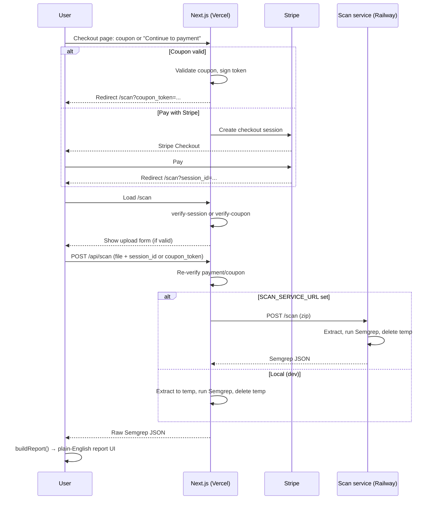

# VibeScan architecture

This document describes how VibeScan works end-to-end for developers with security experience. It covers data flow, trust boundaries, and where code runs.

---

## 1. High-level summary

- **Product:** VibeScan — security scanning for non-technical builders who use AI tools (Lovable, Bolt, Cursor). The user pays (or uses a coupon), uploads a zip of app source code, and receives a plain-English report of findings and fix suggestions.
- **Stack:** Next.js (App Router) on Vercel; optional **scan-service** (Flask + Semgrep in Docker) on Railway when Semgrep is not available on Vercel.
- **Security model:** Access to run a scan is gated by (a) a paid Stripe Checkout session, or (b) a server-signed coupon token. Every scan request is re-verified (session or token) before any user code is processed.

---

## 2. System diagram

**Actors:** User (browser), Vercel (Next.js app + API routes), Stripe, optionally Railway (scan-service).

**Flow:** Checkout (Stripe or coupon) → redirect to `/scan` with `session_id` or `coupon_token` → client verifies via API → user uploads zip → POST /api/scan with proof → Next.js verifies again, then either runs Semgrep locally (dev) or forwards zip to scan-service (prod) → raw Semgrep JSON returned → client transforms to plain-English report via [src/lib/semgrep-report.ts](src/lib/semgrep-report.ts).

---

## 3. Trust boundaries and verification

**Who can run a scan:** Only requests that present either (1) a valid Stripe Checkout `session_id` with `payment_status === "paid"` (verified server-side with the Stripe API), or (2) a valid `coupon_token` (HMAC-SHA256 signed, verified against the current `VALID_COUPON_CODES` in [src/lib/coupon.ts](src/lib/coupon.ts)). There is no other authentication (e.g. Supabase) in the current design.

**Where verification happens:**

- **Scan page load:** The client calls GET /api/verify-session or GET /api/verify-coupon. If the result is invalid or the user has neither `session_id` nor `coupon_token`, the app redirects to /checkout.
- **Scan API (POST /api/scan):** The API re-checks the Stripe session or verifies the coupon token. If invalid, it returns 403. So proof is validated twice: once for the UI (so the upload form is shown only when allowed), and once for the actual scan (so the API cannot be used without valid proof).

**Coupon tokens:** Tokens have no expiry. Validity is re-evaluated on every use against the current `VALID_COUPON_CODES` list. To revoke a code, remove it (or set `bypassPayment: false`) in [src/lib/coupon.ts](src/lib/coupon.ts) and redeploy. Tokens are signed with `COUPON_SECRET` or, if unset, `STRIPE_SECRET_KEY`.

---

## 4. Data flow: code and report

**Upload:** The zip file is sent in multipart form from the browser to Next.js POST /api/scan (along with `session_id` or `coupon_token`). When `SCAN_SERVICE_URL` is set, Next.js does not persist the zip to disk; it forwards the buffer in memory to the scan-service. When scanning locally (no `SCAN_SERVICE_URL`), Next.js extracts to a temp directory, runs Semgrep, then deletes the temp dir in a `finally` block.

**Scan-service (Railway):** Receives the zip via POST /scan, extracts to a temp directory, runs `semgrep scan --config auto --json`, returns the JSON, then deletes the temp dir. No long-term storage of user code. Max upload size is 50 MB; Semgrep timeout is 300 seconds.

**Report:** Raw Semgrep JSON is returned to the client. The client uses [src/lib/semgrep-report.ts](src/lib/semgrep-report.ts) to map rule IDs and messages to plain-English titles, explanations, “why it matters,” and fix suggestions. No report data is stored server-side in the current design; the report exists only in the browser session.

---

## 5. Key components (for a security reviewer)

| Component | Role |
|-----------|------|
| [src/app/checkout/page.tsx](src/app/checkout/page.tsx) | Coupon input + “Continue to payment”; calls /api/validate-coupon and /api/create-checkout-session. |
| [src/app/api/create-checkout-session/route.ts](src/app/api/create-checkout-session/route.ts) | Creates Stripe Checkout session; success_url includes `session_id` in query. |
| [src/app/api/validate-coupon/route.ts](src/app/api/validate-coupon/route.ts) | Checks code against VALID_COUPON_CODES, returns signed token if valid. |
| [src/app/api/verify-session/route.ts](src/app/api/verify-session/route.ts) | Stripe API: retrieve session, confirm payment_status === "paid". |
| [src/app/api/verify-coupon/route.ts](src/app/api/verify-coupon/route.ts) | Verifies coupon token (signature + code still in valid list). |
| [src/app/api/scan/route.ts](src/app/api/scan/route.ts) | Enforces payment (session or coupon); accepts zip; forwards to scan-service or runs Semgrep locally; returns JSON. |
| [src/lib/coupon.ts](src/lib/coupon.ts) | VALID_COUPON_CODES, signToken, verifyCouponToken, isCodeValidForBypass. |
| [scan-service/app.py](scan-service/app.py) | Flask: POST /scan → extract zip → Semgrep → JSON; temp dir cleaned in finally. |

---

## 6. Environment and deployment

**Vercel (Next.js):** Required: `STRIPE_SECRET_KEY`, `NEXT_PUBLIC_APP_URL`. Optional: `COUPON_SECRET`, `SCAN_SERVICE_URL`. If `SCAN_SERVICE_URL` is set, scans are forwarded to that URL; otherwise Semgrep must be installed on the server (typical only in local dev).

**Railway (scan-service):** Single service with root directory `scan-service`. Exposes an HTTPS URL. There is no authentication between Vercel and Railway in the current implementation — security is “only our backend calls this” plus network isolation. In a locked-down setup you could place the scan-service in a private network and allow only Vercel IPs or use a shared secret header; that is not implemented today.

---

## 7. Security-relevant notes and limitations

- **No auth beyond payment/coupon:** Anyone with a valid `session_id` or `coupon_token` can run scans. Session IDs are tied to a single Stripe payment but can be reused for multiple scans in our app; coupon tokens can be reused until the code is removed from the list.
- **Code handling:** The zip is not stored after the scan; temp dirs are deleted. The scan-service is stateless.
- **Secrets:** Stripe secret key and coupon signing secret must be server-side only; they are never exposed to the client.
- **Future:** Supabase/auth is planned; report access and “one scan per purchase” could be tightened at that point.
